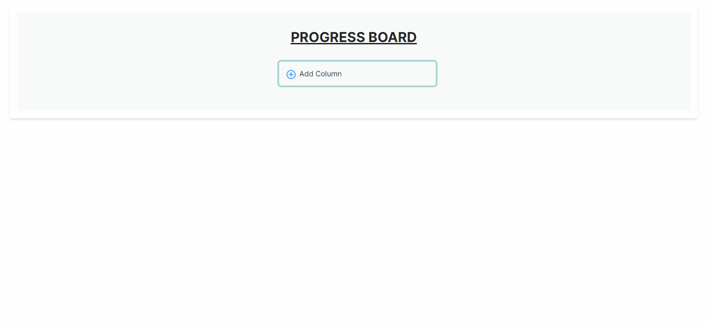

<div align="center">
  <h1 align="center">KANBAN PROGRESS BOARD</h1>
</div>

<!-- ABOUT THE PROJECT -->

## About The Project

This is a visual tool that empowers your project team in tracking all kinds of projects, workflows and tasks. Add files, to-do lists, and even automations: Customize them all to best suit the way your team works. You can add colons for all the processes you want, create tasks for these business processes and assign the tasks to the relevant person.

<!-- DESCRİPTİON -->

## Description

- React.js Vite.js and Typescript were used during the project development process.
- Styling was done with Tailwind CSS.
- Ant design icons was used as the UI library.
- Dnd-kit was used for Kanban developments.
- The project is designed as a single page.
- There is a structure in the project where you can add any number of colons to the workflows, and you can manage the flows by making workflow simulations.
- You can add or remove as many tasks as you want in each workflow column.
- You can move the tasks you added to the colon you want using the drag and drop method. You can also change the colon locations using the drag and drop method.
- You can assign responsible personnel for tasks and view all personnel under your management from the opened modal. If there are many personnel, you can request as many personnel as you want with the load more button.
- Since all workflow processes are recorded on localstorage, your process management is stored securely.
- By continuing the project development process, it is aimed to create a more personalized process management panel similar to the Trello Management panel.

<p align="right">(<a href="#top">back to top</a>)</p>

<!-- PROJECT OUTCOME -->

## Project Outcome



<!-- PROJECT SKELETON -->

## Project Skeleton

```
KANBAN PROGRESS BOARD (folder)
|
├── public
│    └── vite.svg
├── src
│    ├── components
│    │     ├── ColumnContainer.tsx
│    │     ├── KanbanBoard.tsx
│    │     ├── ProgressBoardContainer.tsx
│    │     └── TaskCard.tsx
│    ├── helpers
│    │     └── storage.ts
│    ├── App.tsx
│    ├── App.css
│    ├── index.tsx
│    ├── index.css
│    ├── rtypes.ts
│    └── vite-env.d.ts
├── index.html
├── package.json
├── package-lock-json
├── postcss.config.js
├── tailwind.config.js
├── tsconfig.json
├── tsconfig.node.json
└── README.md
```

<p align="right">(<a href="#top">back to top</a>)</p>

<!-- GETTING STARTED -->

## Getting Started

This is an example of how you may give instructions on setting up your project locally.
To get a local copy up and running follow these simple example steps.

### Prerequisites

This is an example of how to list things you need to use the software and how to install them.

- npm
  ```sh
  npm install npm@latest -g
  ```

### Installation

1. Clone the repo
   ```sh
   git clone https://github.com/enes9103/trll_mxTeam_kanban_progress_board.git
   ```
2. Install NPM packages

   ```sh
   npm install
   ```

   ```sh
   npm install --save-dev @types/react
   ```

3. The project is ready, you can start using it now.
   You can run:

   `npm run dev`

   Runs the app in the development mode.\
   Open [http://localhost:5173/](http://localhost:5173) to view it in the browser.

<!-- CONTRIBUTING -->

## Contributing

Contributions are what make the open source community such an amazing place to learn, inspire, and create. Any contributions you make are **greatly appreciated**.

If you have a suggestion that would make this better, please fork the repo and create a pull request. You can also simply open an issue with the tag "enhancement".
Don't forget to give the project a star! Thanks again!

1. Fork the Project
2. Create your Feature Branch (`git checkout -b feature/AmazingFeature`)
3. Commit your Changes (`git commit -m 'Add some AmazingFeature'`)
4. Push to the Branch (`git push origin feature/AmazingFeature`)
5. Open a Pull Request

<!-- LICENSE -->

## License

Distributed under the MIT License. See `LICENSE.txt` for more information.

<p align="right">(<a href="#top">back to top</a>)</p>
